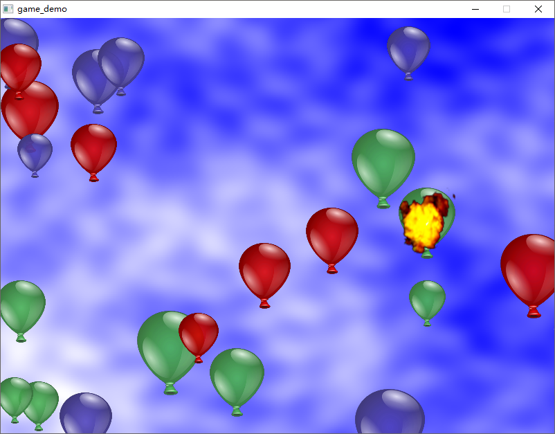

GOGAME

#### :open_file_folder:sdl2

sdl2初次使用demo

#### :open_file_folder:pong

sdl2像素绘制游戏

#### :open_file_folder:simplexnoise

使用杂乱延续的noise  绘制出画面

我们现在可以给`pong`加一个渐变背景，使用我们抽象出来的`noise`包下的方法

### :open_file_folder:balloons

加载图片并绘制

使用图片里的气球代替`pong`上的白色像素球

### :open_file_folder:balloos2
- -添加背景；不再使用像素绘制；GPU渲染

    

- 使用仅有的三个素材，渲染出多个气球，并使用package vector3下的向量代替原有的pos

- 气球移动

- 鼠标输入

- 点击气球，气球爆炸，发出声音,爆炸效果

    

